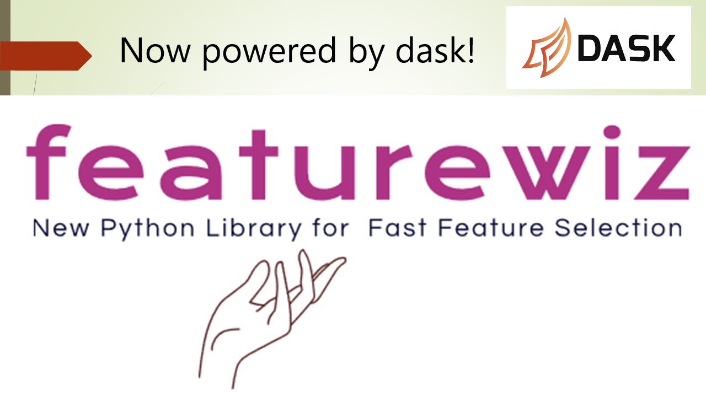
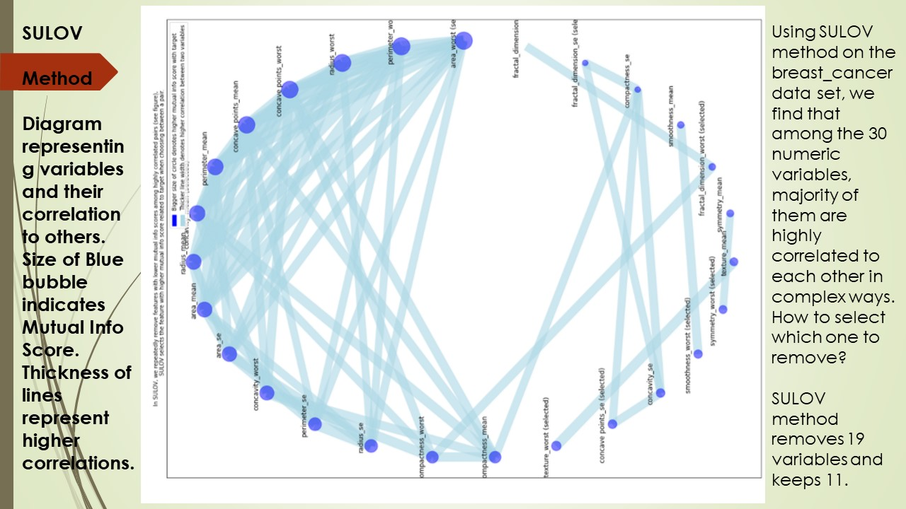
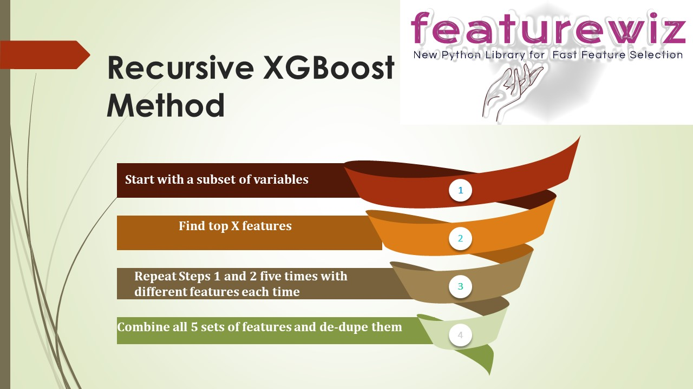

# featurewiz



Featurewiz is a new python library for selecting the best features in your data set fast!
(featurewiz logo created using Wix)
<p>Two methods are used in this version of featurewiz:<br>
1. SULOV -> SULOV means Searching for Uncorrelated List of Variables. The SULOV method is explained in this chart below.
Here is a simple way of explaining how it works:
<ol>
<li>Find all the pairs of highly correlated variables exceeding a correlation threshold (say absolute(0.7)).
<li>Then find their MIS score (Mutual Information Score) to the target variable. MIS is a non-parametric scoring method. So its suitable for all kinds of variables and target.
<li>Now take each pair of correlated variables, then knock off the one with the lower MIS score.
<li>What’s left is the ones with the highest Information scores and least correlation with each other.
</ol>




2. Recursive XGBoost: Once SULOV has selected variables that have high mutual information scores with least less correlation amongst them, we use XGBoost to repeatedly find best features among the remaining variables after SULOV. The Recursive XGBoost method is explained in this chart below.



Here is how it works:
<ol>
<li>Select all variables in data set and the full data split into train and valid sets.
<li>Find top X features (could be 10) on train using valid for early stopping (to prevent over-fitting)
<li>Then take next set of vars and find top X
<li>Do this 5 times. Combine all selected features and de-duplicate them.
</ol>

3. <b>Performing Feature Engineering</b>: One of the gaps in open source AutoML tools and especially Auto_ViML has been the lack of feature engineering capabilities that high powered competitions like Kaggle required. The ability to create "interaction" variables or adding "group-by" features or "target-encoding" categorical variables was difficult and sifting through those hundreds of new features was painstaking and left only to "experts". Now there is some good news.
<br>
featurewiz (https://lnkd.in/eGep5uG) now enables you to add hundreds of such features at the click of a code. Set the "feature_engg" flag to "interactions", "groupby" or "target" and featurewiz will select the best encoders for each of those options and create hundreds (perhaps thousands) of features in one go. Not only that, it will use SULOV method and Recursive XGBoost to sift through those variables and find only the least correlated and most important features among them. All in one step!.<br>

4. <b>Building the simplest and most "interpretable" model</b>: Featurewiz represents the "next best" step you must perform after doing feature engineering  since you might have added some highly correlated or even useless features when you use automated feature engineering. featurewiz ensures you have the least number of features needed to build a high performing or equivalent model.

<b>A WORD OF CAUTION:</b> Just because you can, doesn't mean you should. Make sure you understand feature engineered variables before you attempt to build your model any further. featurewiz displays the SULOV chart which can show you the 100's of newly created variables added to your dataset using featurewiz.
<br>
But you still have two problems:
1. How to interpret those newly created features?
2. Does the model overfit now on these many features?
<br>
Both are very important questions and you must be very careful using this feature_engg option in featurewiz. Otherwise, you can create a "garbage in, garbage out" problem. Caveat Emptor!
<br>
<p>To upgrade to the best, most stable and full-featured version always do the following: <br>
<code>Use $ pip install featurewiz --upgrade --ignore-installed</code><br>
or
<code>pip install git+https://github.com/AutoViML/featurewiz.git </code><br>

## Table of Contents
<ul>
<li><a href="#background">Background</a></li>
<li><a href="#install">Install</a></li>
<li><a href="#usage">Usage</a></li>
<li><a href="#api">API</a></li>
<li><a href="#maintainers">Maintainers</a></li>
<li><a href="#contributing">Contributing</a></li>
<li><a href="#license">License</a></li>
</ul>

## Background

To learn more about how featurewiz works under the hood, watch this [video](https://www.youtube.com/embed/ZiNutwPcAU0)<br>

<p>featurewiz was designed for selecting High Performance variables with the fewest steps.

In most cases, featurewiz builds models with 20%-99% fewer features than your original data set with nearly the same or slightly lower performance (this is based on my trials. Your experience may vary).<br>
<p>
featurewiz is every Data Scientist's feature wizard that will:<ol>
<li><b>Automatically pre-process data</b>: you can send in your entire dataframe "as is" and featurewiz will classify and change/label encode categorical variables changes to help XGBoost processing. It classifies variables as numeric or categorical or NLP or date-time variables automatically so it can use them correctly to model.<br><br>
<li><b>Perform feature engineering automatically</b>: The ability to create "interaction" variables or adding "group-by" features or "target-encoding" categorical variables is difficult and sifting through those hundreds of new features is painstaking and left only to "experts". Now, with featurewiz you can create hundreds or even thousands of new features with the click of a mouse. This is very helpful when you have a small number of features to start with. However, be careful with this option. You can very easily create a monster with this option.
<li><b>Perform feature reduction automatically</b>. When you have small data sets and you know your domain well, it is easy to perhaps do EDA and identify which variables are important. But when you have a very large data set with hundreds if not thousands of variables, selecting the best features from your model can mean the difference between a bloated and highly complex model or a simple model with the fewest and most information-rich features. featurewiz uses XGBoost repeatedly to perform feature selection. You must try it on your large data sets and compare!<br>
<li><b>Explain SULOV method graphically </b> using networkx library so you can see which variables are highly correlated to which ones and which of those have high or low mutual information scores automatically. Just set verbose = 2 to see the graph. <br>
</ol>

<b>***  Notes of Gratitude ***</b>:<br>
<ol>
<li><b>featurewiz is built using xgboost, numpy, pandas and matplotlib</b>. It should run on most Python 3 Anaconda installations. You won't have to import any special libraries other than "XGBoost" and "networkx" library. </li>
<li><b>We use "networkx" library for charts and interpretability</b>. <br>But if you don't have these libraries, featurewiz will install those for you automatically.</li>
<li>Alex Lekov (https://github.com/Alex-Lekov/AutoML_Alex/tree/master/automl_alex) for his DataBunch module which is used by the tool.</li>
<li>Category Encoders library in Python : This is an amazing library. Make sure you read all about the encoders that featurewiz uses here: https://contrib.scikit-learn.org/category_encoders/index.html </li>
</ol>

## Install

**Prerequsites:**

- [Anaconda](https://docs.anaconda.com/anaconda/install/)

To clone featurewiz, it is better to create a new environment, and install the required dependencies:

To install from PyPi:

```
conda create -n <your_env_name> python=3.7 anaconda
conda activate <your_env_name> # ON WINDOWS: `source activate <your_env_name>`
pip install featurewiz
or
pip install git+https://github.com/AutoViML/featurewiz.git
```

To install from source:

```
cd <featurewiz_Destination>
git clone git@github.com:AutoViML/featurewiz.git
# or download and unzip https://github.com/AutoViML/featurewiz/archive/master.zip
conda create -n <your_env_name> python=3.7 anaconda
conda activate <your_env_name> # ON WINDOWS: `source activate <your_env_name>`
cd featurewiz
pip install -r requirements.txt
```

## Usage

In the same directory, open a Jupyter Notebook and use this line to import the .py file:

```
from featurewiz import featurewiz
```

Load a data set (any CSV or text file) into a Pandas dataframe and give it the name of the target(s) variable. If you have more than one target, it will handle multi-label targets too. Just give it a list of variables in that case. If you don't have a dataframe, you can simply enter the name and path of the file to load into featurewiz:

```
featurewiz(dataname, target, corr_limit=0.7, verbose=0, sep=",", header=0,
                      test_data='', feature_engg='', category_encoders='',
                      ```

Output: is a Tuple which contains the list of features selected, the dataframe modified with new features and the test data modified.
This list of selected features is ready for you to now to do further modeling.

featurewiz works on any Multi-Class, Multi-Label Data Set. So you can have as many target labels as you want.
You don't have to tell featurwiz whether it is a Regression or Classification problem. It will decide that automatically.

## API

**Arguments**

- `dataname`: could be a datapath+filename or a dataframe. It will detect whether your input is a filename or a dataframe and load it automatically.
- `target`: name of the target variable in the data set.
- `corr_limit`: if you want to set your own threshold for removing variables as highly correlated, then give it here. The default is 0.7 which means variables less than -0.7 and greater than 0.7 in pearson's correlation will be candidates for removal.
- `verbose`: This has 3 possible states:
  - `0` limited output. Great for running this silently and getting fast results.
  - `1` more verbiage. Great for knowing how results were and making changes to flags in input.
  - `2` SULOV charts and output. Great for finding out what happens under the hood for SULOV method.
`test_data`: If you want to transform test data in the same way you are transforming dataname, you can.
    test_data could be the name of a datapath+filename or a dataframe. featurewiz will detect whether
        your input is a filename or a dataframe and load it automatically. Default is empty string.
`feature_engg`: You can let featurewiz select its best encoders for your data set by settning this flag
    for adding feature engineering. There are three choices. You can choose one, two or all three.
    'interactions': This will add interaction features to your data such as x1*x2, x2*x3, x1**2, x2**2, etc.
    'groupby': This will generate Group By features to your numeric vars by grouping all categorical vars.
    'target':  This will encode & transform all your categorical features using certain target encoders.
    Default is empty string (which means no additional features)
`category_encoders`: Instead of above method, you can choose your own kind of category encoders from below.
    Recommend you do not use more than two of these. Featurewiz will automatically select only two from your list.
    Default is empty string (which means no encoding of your categorical features)
        ['HashingEncoder', 'SumEncoder', 'PolynomialEncoder', 'BackwardDifferenceEncoder',
        'OneHotEncoder', 'HelmertEncoder', 'OrdinalEncoder', 'FrequencyEncoder', 'BaseNEncoder',
        'TargetEncoder', 'CatBoostEncoder', 'WOEEncoder', 'JamesSteinEncoder']

**Return values**
If you don't want any feature_engg, then featurewiz will return just one thing:
- `features`: the fewest number of features in your model to make it perform well
Otherwise, Featurewiz can output either one dataframe or two depending on what you send inside as input.
    1. trainm: modified train dataframe is the dataframe that is modified with engineered and selected features from dataname.
    2. testm: modified test dataframe is the dataframe that is modified with engineered and selected features from test_data

## Maintainers

* [@AutoViML](https://github.com/AutoViML)

## Contributing

See [the contributing file](CONTRIBUTING.md)!

PRs accepted.

## License

Apache License 2.0 © 2020 Ram Seshadri

## DISCLAIMER
This project is not an official Google project. It is not supported by Google and Google specifically disclaims all warranties as to its quality, merchantability, or fitness for a particular purpose.
